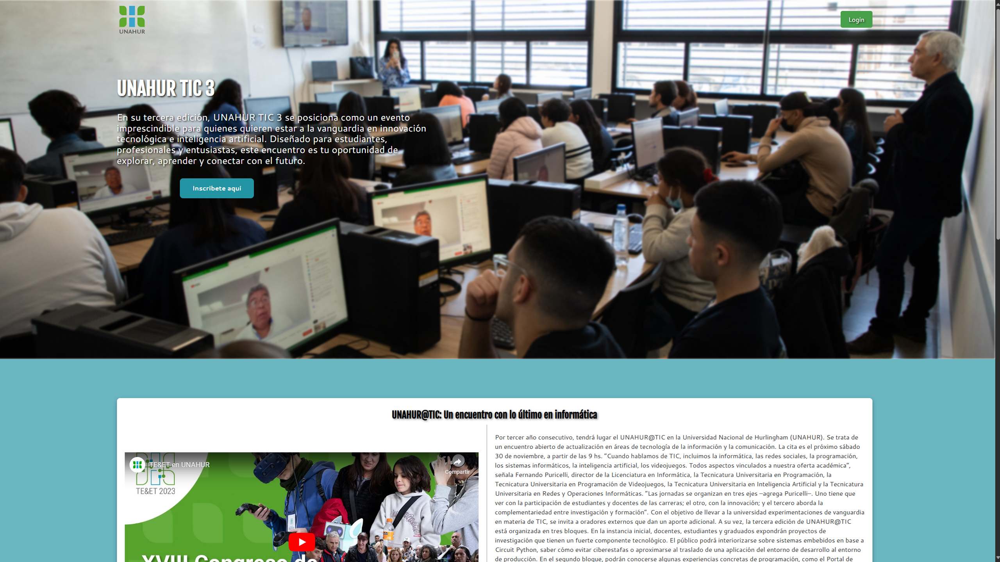
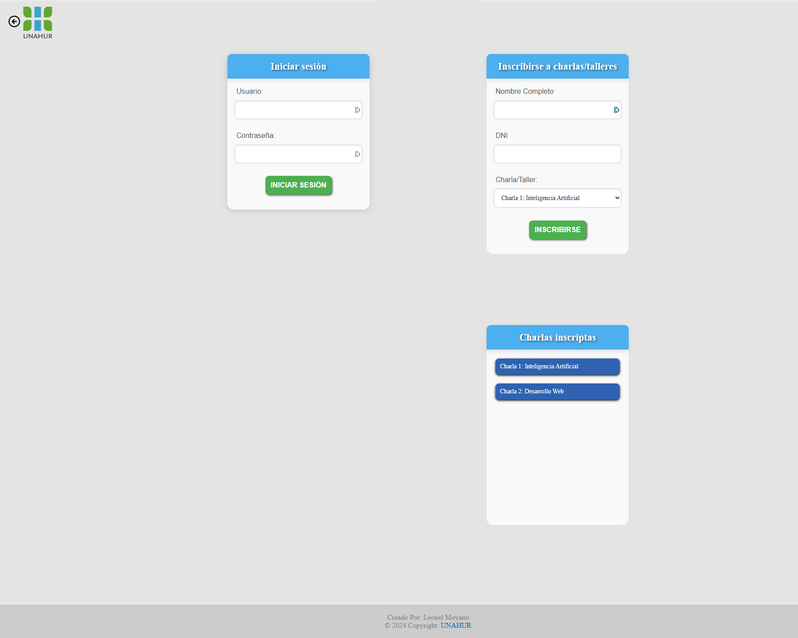

UNAHUR TIC #3
Link : [UNAHUR TIC #3](https://leonelmoyanocode.github.io/universidadhurlingham/)

Este proyecto universitario consiste en el desarrollo de una página web para un evento de la universidad. Está compuesto por dos páginas web interconectadas, diseñadas para ser estéticas, intuitivas y totalmente responsivas. Se enfoca en ofrecer una experiencia de usuario envolvente y funcional.

# 📝 Descripción del Proyecto
El evento está compuesto por dos páginas principales:

# Página Principal (index.html):

* Información introductoria del evento.

* Video y/o audio de presentación.

* Grilla con imágenes en formato cuadrícula relacionadas con las charlas y actividades del evento.

* Programa del evento con las charlas que se darán.

* Menú principal funcional y un pie de página.

* Zona de login para estudiantes de la universidad (funcionalidad básica).

  

# Página del Alumno (alumno.html):

* Sección para inscribirse en charlas/talleres a través de un formulario visual sin javascript se me pidio asi.

* Sección para visualizar las charlas/talleres a los que ya se ha inscrito, con al menos dos opciones plenamente visual tambien se me pidio asi.

* Menú funcional para volver a la página principal.

* Pie de página replicado de la página principal.

  

# ✨ Tecnologías Utilizadas

* HTML5: Estructura de las páginas.

* CSS3: Estilización y diseño responsivo.

